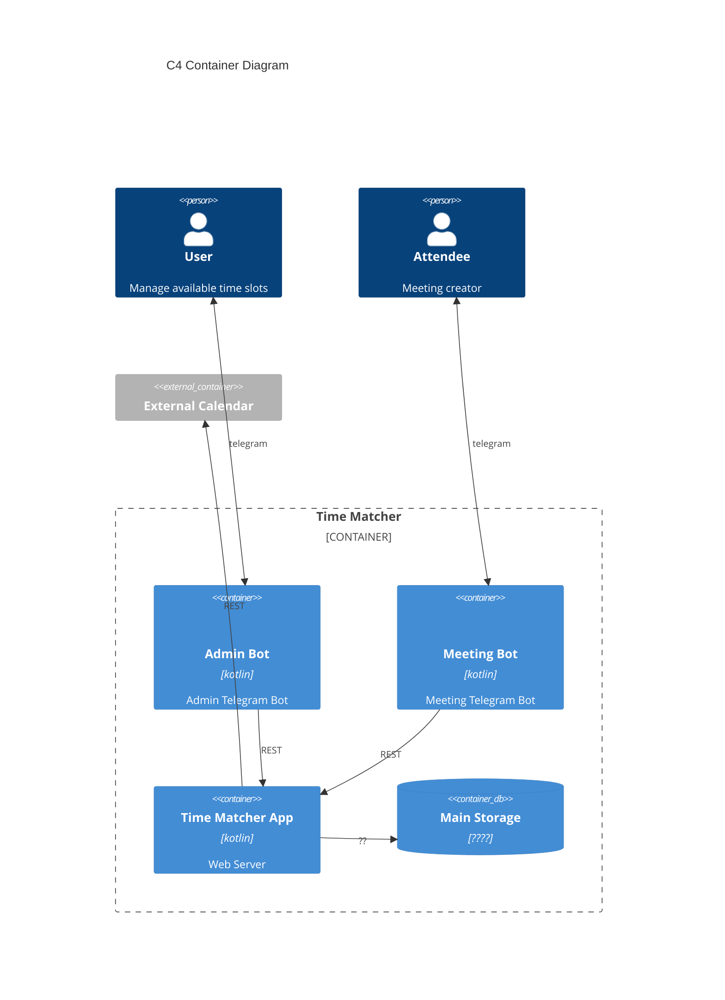

C4 Container Diagram

```mermaid
C4Container
title C4 Container Diagram

Person(host, "User", "Manage available time slots")
Person(attendee, "Attendee", "Meeting creator")

Container_Ext(extCalendar, "External Calendar")

Container_Boundary(container, "Time Matcher") {
    Container(adminBot, "Admin Bot", kotlin, "Admin Telegram Bot", robot,)
    Container(meetingBot, "Meeting Bot", kotlin, "Meeting Telegram Bot", robot,)
    Container(server, "Time Matcher App", kotlin, "Web Server")
    ContainerDb(mainDb, "Main Storage", "????")
}

BiRel(host, adminBot, "telegram")
Rel(adminBot, server, "REST")

BiRel(attendee, meetingBot, "telegram")
Rel(meetingBot, server, "REST")

Rel(server, extCalendar, "REST")
Rel(server, mainDb, "??")

```
