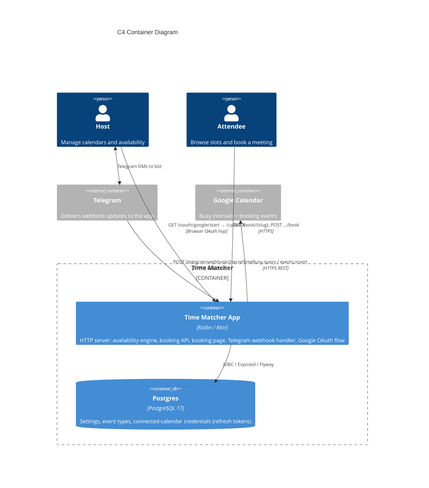

C4 Container Diagram

> Phase 1 (implemented): in-app availability finder — `GET /availability/slots` over in-memory calendars. External calendar sync, persistence, booking, and bots are later phases.

> Phase 2a (implemented): EventTypes + booking. Config (settings, event types, connected calendars) in H2; bookings written to the calendar via the CalendarWriter port. Real Google calendar + host auth are later slices.

> Phase 2c (implemented): public booking page at `GET /book/{slug}` — a self-contained HTML/JS page (attendee timezone; 1-day mobile / 7-day desktop) driving the booking JSON API.

> Phase 2d (implemented): host-only Telegram bot is the management surface — connect/list/remove Google Calendars and pick the booking target. Connecting uses a browser OAuth hop (`/oauth/google/start` → Google consent → `/oauth/google/callback`). Availability unions busy across all connected calendars; bookings write to the ★ target.

> Phase 3 (implemented): Telegram updates delivered via **webhook** (`POST /telegram/webhook/{secret}`) instead of long-polling; Postgres (Hikari-pooled) replaces the H2 file-backed database for runtime (H2 retained for tests and AOT training); multi-stage Docker image with JDK 25 AOT cache (~0.5 s cold start); docker-compose.yml (app + Postgres + optional cloudflared tunnel profile).

