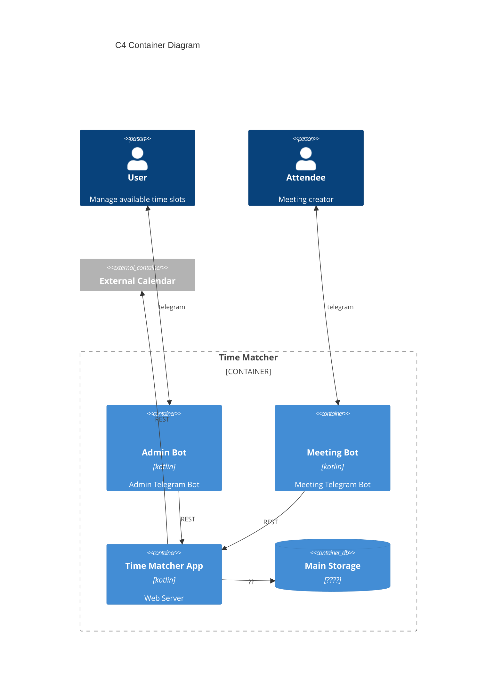

C4 Container Diagram

> Phase 1 (implemented): in-app availability finder — `GET /availability/slots` over in-memory calendars. External calendar sync, persistence, booking, and bots are later phases.

> Phase 2a (implemented): EventTypes + booking. Config (settings, event types, connected calendars) in H2; bookings written to the calendar via the CalendarWriter port. Real Google calendar + host auth are later slices.

> Phase 2c (implemented): public booking page at `GET /book/{slug}` — a self-contained HTML/JS page (attendee timezone; 1-day mobile / 7-day desktop) driving the booking JSON API. (Host admin Telegram bot and deployment are separate, later.)

