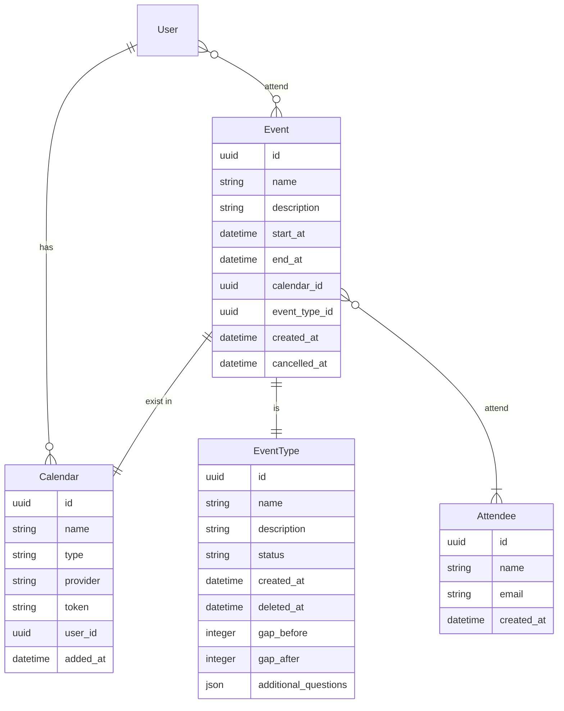

Data Model

```mermaid
erDiagram
Attendee {
  uuid id
  string name
  string email
  datetime created_at
}

Calendar {
  uuid id
  string name
  string type 
  string provider
  string token
  uuid user_id
  datetime added_at
}

EventType {
  uuid id
  string name
  string description
  string status
  datetime created_at
  datetime deleted_at
  integer gap_before
  integer gap_after
  json additional_questions
}

Event {
  uuid id
  string name
  string description
  datetime start_at
  datetime end_at
  uuid calendar_id
  uuid event_type_id
  datetime created_at
  datetime cancelled_at
}

User ||--o{ Calendar : has
User }o--o{ Event : attend
Event ||--|| EventType : is
Event ||--|| Calendar : "exist in"
Event }o--|{ Attendee : attend
```
